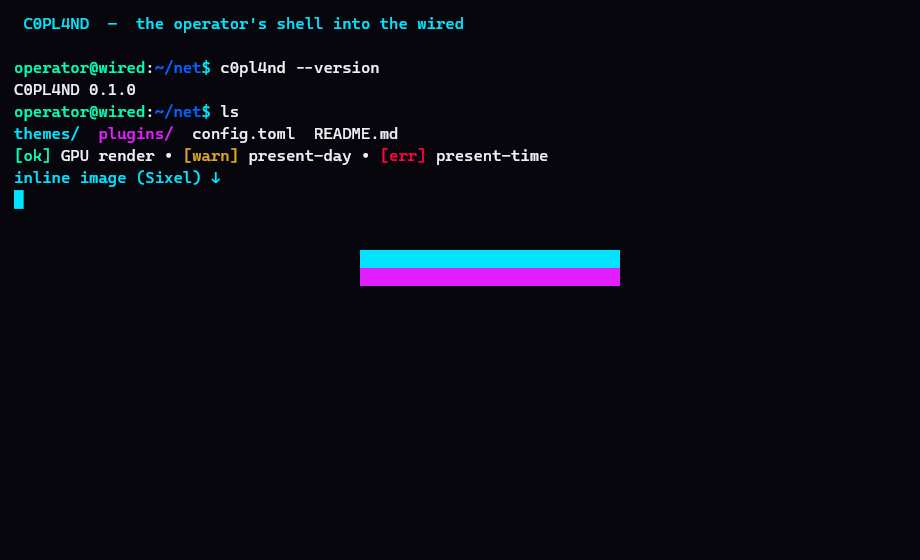

<p align="center">
  
</p>

<h1 align="center">C0PL4ND</h1>

<p align="center"><strong>the operator's shell into the wired</strong></p>

<p align="center">
  <a href="#"></a>
  <a href="#license"></a>
  <a href="#"></a>
  <a href="#"></a>
</p>

---

**C0PL4ND is a fast, GPU-accelerated, cross-platform terminal emulator for Windows, Linux, and macOS — built in Rust, local-first by design, and great out of the box with zero configuration.**

It gives developers a modern terminal with built-in tabs, splits, and session safety (no `tmux` required), Kitty/Sixel inline images, command-palette navigation, OSC 133/7/8 shell integration, and a striking retro-future default theme — without ever asking you to create an account, and without sending your shell input anywhere. Your terminal is yours.

> The name is a nod to *Serial Experiments Lain*'s "Copland OS." C0PL4ND is your shell into the wired.

---

## Why C0PL4ND

Most modern terminals make you choose. The fastest ones skip Windows or ship with no tabs. The feature-rich ones make you learn a config language or hand a cloud service your login and your keystrokes. C0PL4ND refuses the tradeoff.

- **Windows-first, not Windows-afterthought.** The two most-loved modern terminals don't run on Windows at all. C0PL4ND treats Windows as a first-class platform with native ConPTY integration and GPU-accelerated rendering — alongside equally first-class Linux and macOS builds.
- **Zero-config, great defaults.** It's genuinely usable the moment you install it. You never *have* to open a config file. When you want to tweak something, it's a simple, readable TOML file — never a programming language you have to learn (and never one a typo can lock you out of).
- **Built-in multiplexing + session safety.** Tabs, splits, and panes are built in. You don't need `tmux` to organize your work — and C0PL4ND won't close a window full of running processes without warning you first.
- **GPU-fast and memory-light.** Hardware-accelerated rendering with glyph-atlas caching and damage tracking keeps input latency low and idle memory small.
- **Local-first. No account. No telemetry.** There is no login wall, no required cloud sync, and telemetry is off by default. Your shell input never leaves your device. This is a *trust* feature, and we treat it as one.
- **Open and free.** Dual-licensed MIT OR Apache-2.0. Use it, fork it, embed it.

---

## Features

- **Cross-platform** — native builds for Windows, Linux, and macOS from a single Rust core.
- **GPU rendering** — `wgpu`-backed renderer with a cached glyph atlas and dirty-region damage tracking for low key-to-screen latency.
- **Built-in tabs, splits & panes** — full native multiplexing; no external multiplexer needed.
- **Session safety** — confirms before closing windows with running processes; never silently drops your work.
- **Local-first & private** — no account, no required cloud, telemetry off by default, shell I/O stays on your machine.
- **Shell integration** — OSC 133 semantic prompt zones (jump-to-prompt, select-last-output), OSC 7 working-directory tracking, OSC 8 clickable hyperlinks.
- **Inline images** — Kitty graphics protocol plus Sixel fallback for previewing images right in the terminal.
- **Search** — fast in-buffer search across scrollback.
- **Command palette** — discover and run actions without memorizing keybindings.
- **Startup panel** — a neofetch-style splash on launch: a brand ASCII logo beside live local stats (OS, kernel, host, uptime, shell, CPU, memory, GPU). Reads only local facts — never the network. Toggle with `startup_panel` in config.
- **Retro-future default theme** — the *Retro-Future Anime OS* aesthetic ships as the default: **VOID BLACK + SIGNAL TEAL + NEON PINK**, with an optional CRT/scanline effect (off by default).
- **Readable TOML config** — simple key-value configuration with live reload; sensible defaults mean most users never touch it.

---

## Screenshots

> Media lives in [`assets/media/`](assets/media/). Screenshots are generated
> headlessly (no display needed) with `c0pl4nd --screenshot <path.png>`.



The default `itasha-void` theme: VOID BLACK background, SIGNAL TEAL accents,
brand-coloured output, blinking cursor, and an inline Sixel image (the
teal/pink band — rendered via the GPU textured-quad image pipeline).

---

## Install

### Windows

**Installer (recommended)** — download `c0pl4nd-<version>-x86_64.msi` from the
[Releases](../../releases) page and run it. The MSI installs C0PL4ND under
*Program Files*, adds it to your `PATH`, and creates a Start Menu entry.

Or via [winget](https://learn.microsoft.com/windows/package-manager/):

```powershell
winget install Itasha.C0PL4ND
```

Or grab the portable `.zip` from [Releases](../../releases) and run
`c0pl4nd.exe` directly — no install required.

### macOS

```bash
brew install --cask c0pl4nd
```

### Linux

Download the latest AppImage from the [Releases](../../releases) page, make it executable, and run it:

```bash
chmod +x C0PL4ND-*.AppImage
./C0PL4ND-*.AppImage
```

Or use the install script:

```bash
curl -fsSL https://get.c0pl4nd.dev/install.sh | sh
```

---

## Configuration

C0PL4ND works perfectly with no configuration. When you want to customize it, edit a single readable TOML file:

- **Linux/macOS:** `~/.config/c0pl4nd/config.toml`
- **Windows:** `%APPDATA%\c0pl4nd\config.toml`

Changes are applied live on save. See **[CONFIG.md](CONFIG.md)** for the full reference, including fonts, themes, keybindings, scrollback, opacity, cursor styles, and the CRT/scanline effect.

---

## Building from source

C0PL4ND is built with Rust. You'll need a recent stable toolchain (install via [rustup](https://rustup.rs)).

```bash
git clone https://github.com/itasha-corp/c0pl4nd.git
cd c0pl4nd
cargo build --release
```

The optimized binary is written to `target/release/`. See **[CONTRIBUTING.md](CONTRIBUTING.md)** for platform-specific prerequisites, running the test suite, and the development workflow.

---

## Contributing

Contributions are welcome. Please read **[CONTRIBUTING.md](CONTRIBUTING.md)** for the development setup, build/test/lint workflow, and pull-request process, and review our **[Code of Conduct](CODE_OF_CONDUCT.md)** before participating.

Found a security issue? Please follow the disclosure process in **[SECURITY.md](SECURITY.md)** — do not open a public issue for vulnerabilities.

---

## License

C0PL4ND is dual-licensed under either of:

- **MIT License** ([LICENSE-MIT](LICENSE-MIT))
- **Apache License, Version 2.0** ([LICENSE-APACHE](LICENSE-APACHE))

at your option. Unless you explicitly state otherwise, any contribution intentionally submitted for inclusion in this project by you, as defined in the Apache-2.0 license, shall be dual-licensed as above, without any additional terms or conditions.

---

<p align="center">
  
</p>
